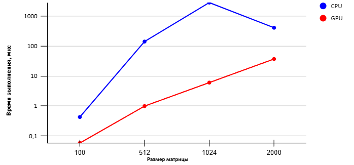

# Описание

В данной работе была реализована программа для перемножения двух матриц целых чисел на CPU и GPU. 
На CPU умножение выполнялось последовательным тройным вложенным циклом: внешний цикл проходил по строкам первой матрицы, средний — по столбцам второй, а внутренний суммировал произведения соответствующих элементов. 
На GPU умножение было реализовано с использованием CUDA ядра, где каждый поток вычисляет отдельный элемент результирующей матрицы. 
Такая параллельная обработка позволяет тысячам потоков одновременно выполнять вычисления, что значительно ускоряет операцию для больших матриц. После вычислений на GPU выполняется синхронизация всех потоков для корректного получения результата.
Для проверки корректности результаты CPU и GPU сравниваются элемент за элементом, и в случае совпадения выводятся как корректные. 

# Результаты

| N | CPU | GPU | Ускорение |
| ------------- | ------------- |
| 100  | 0,428 | 0,058 | 7,379 |
| 512  | 142,140 | 0,993 | 143,142 |
| 1024  | 2853,870 | 6,062 | 470,781 |
| 2000  | 412,400 | 37,232 | 118,511 |

# График

# Выводы

По результатам видно, что использование GPU для перемножения матриц даёт значительное ускорение по сравнению с последовательной реализацией на CPU. 
Для небольших матриц размером 100×100 ускорение составляет примерно в 7 раз, однако при увеличении размеров матриц ускорение значительно возрастает. 
Например, для матриц размером 512×512 и 1024×1024 ускорение достигает ~100-500мкс, отсюда видно высокую эффективность распараллеливания на GPU для больших объёмов данных. 
Для очень крупных матриц 2000×2000 ускорение остаётся значительным, хотя немного снижается по сравнению с пиковыми значениями, что связано с накладными расходами на управление потоками и передачей данных между памятью CPU и GPU. 
В целом, эксперименты подтверждают, что GPU позволяет эффективно использовать параллельные вычисления для операций с матрицами и обеспечивает существенное сокращение времени выполнения по сравнению с традиционным CPU.

