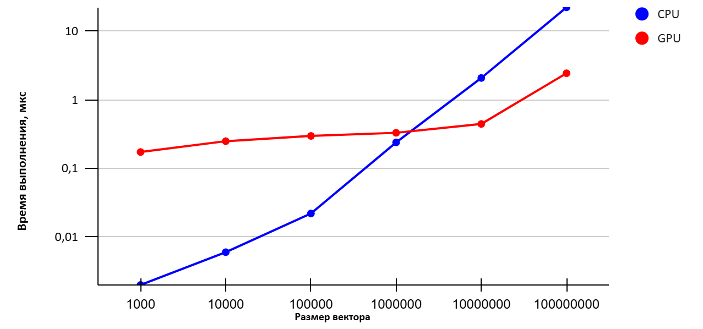

# Описание

В работе реализовано вычисление суммы элементов вектора на CPU и GPU с использованием CUDA. 
Программа генерирует вектор случайных чисел заданного размера и вычисляет сумму его элементов последовательным и параллельным способами, после чего сравнивает время выполнения и корректность результатов.
Последовательная версия алгоритма реализована в функции CPU_vsum, где элементы массива суммируются в одном потоке с использованием обычного цикла. 
Параллельная версия реализована в функции GPU_vsum и ядре GPU_vsum_kernel. В данном случае распараллелено сложение элементов вектора: каждый поток GPU обрабатывает отдельный элемент массива, после чего выполняется параллельное суммирование внутри блока с использованием редукции и разделяемой памяти.
Частичные суммы блоков затем объединяются на CPU.
Такое распараллеливание выбрано, поскольку операции сложения элементов массива независимы друг от друга и могут выполняться одновременно. 
Использование большого количества потоков GPU позволяет значительно ускорить вычисления при работе с векторами большого размера. 
В программе также выполняется замер времени работы CPU и GPU, вычисляется ускорение и проверяется корректность полученных результатов.

# Результаты

| N | CPU | GPU | Ускорение |
| --- | --- | --- | --- |
| 1000 | 0,002 | 0,173 | 0,011 |
| 10000 | 0,006 | 0,249 | 0,024 |
| 100000 | 0,022 | 0,297 | 0,074 |
| 1000000 | 0,239 | 0,330 | 0,724 |
| 10000000 | 2,078 | 0,444 | 4,680 |
| 100000000 | 22,226 | 2,435 | 9,127 |

# График

# Выводы

По результатам экспериментов видно, что при малых размерах вектора вычисления на CPU выполняются быстрее. Например, при размере 1000 элементов время выполнения на CPU составляет 0,002 мс, тогда как на GPU — 0,173 мс. 
Аналогичная ситуация наблюдается до размера 1000000 элементов, где ускорение остаётся меньше единицы.
Начиная с размера 10000000 элементов, GPU начинает показывать преимущество. В этом случае время выполнения на CPU составляет 2,078 мс, а на GPU — 0,444 мс, что даёт ускорение 4,68 раза. 
При размере 100 000 000 элементов разница становится ещё более заметной: CPU выполняет вычисления за 22,226 мс, тогда как GPU — за 2,435 мс, что соответствует ускорению 9,13 раза.
Таким образом, при небольших объёмах данных использование GPU неэффективно из-за накладных расходов, однако при обработке больших векторов GPU обеспечивает значительное ускорение и более высокую производительность.
