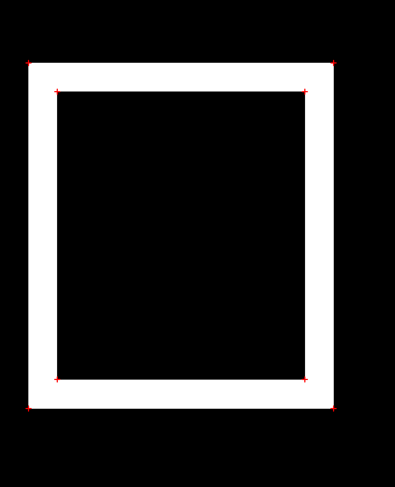

# Описание
В работе реализован алгоритм Харриса для определения угловых точек на GPU и CPU.
Программа загружает входное изображение в градациях серого, отбирает локальные максимумы выше заданного порога и сохраняет результат с отмеченными углами в выходной BMP-файл.

На GPU каждый поток вычисляет отклик одного пикселя независимо от остальных.
Алгоритм состоит из двух частей. Во-первых, вычисляется карта откликов Харриса через оператор Собеля,
во-вторых выполняестся подавление немаксимумов и записываются координаты найденных углов.

На CPU тот же алгоритм реализован последовательно.

# Результаты
GPU - 0.585408ms
CPU - 2232.77ms

GPU оказалось быстрее CPU в 3814 раза.

# Изображения
Входное изображение  

Результат  

# Выводы
Использование GPU позволяет распараллелить вычисление отклика Харриса. Вычисление на GPU показало большое ускорение по сравнению с CPU. При этом результаты GPU и CPU совпали.
Применение текстурной памяти дополнительно ускоряет доступ к пикселям за счёт кэширования и позволяет избежать явных проверок границ изображения в алгоритме.
